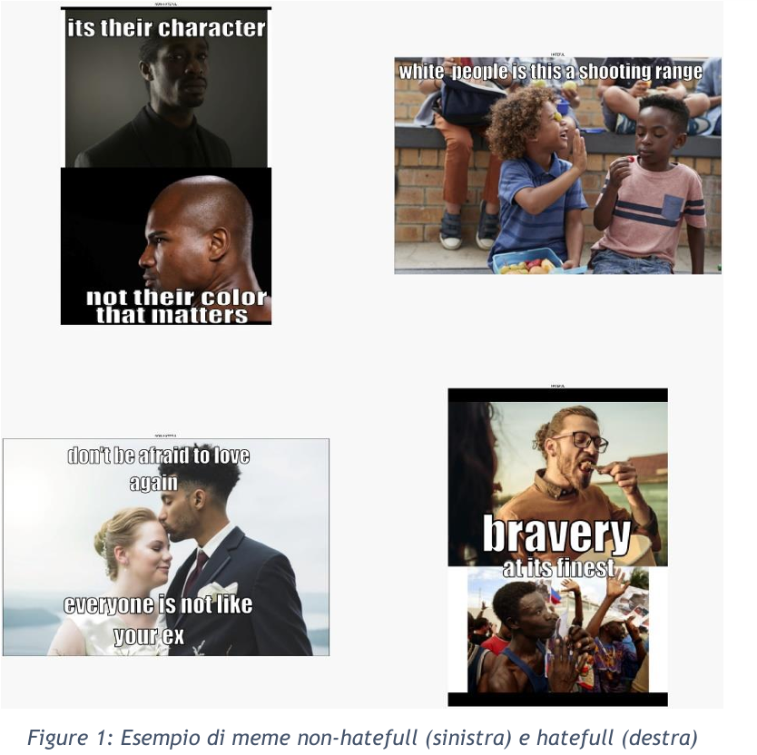
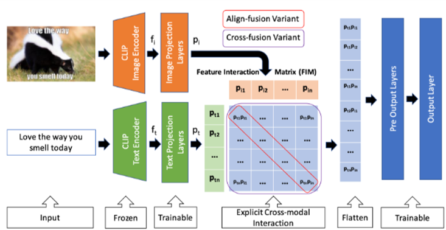
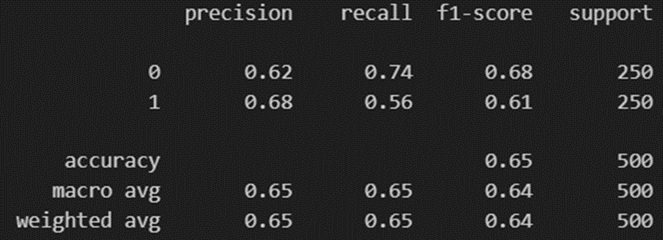
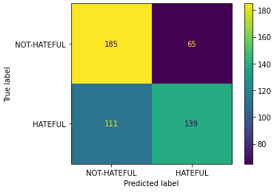
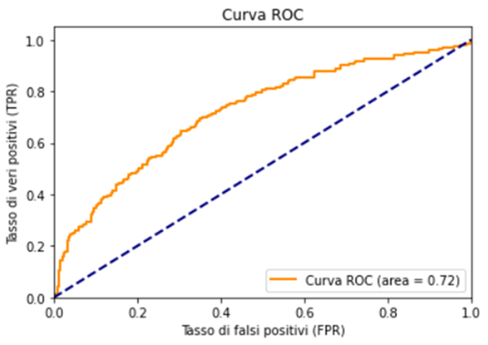

# Multimodal Hateful Meme Classification 🖼️💬🔍

[](https://www.python.org/downloads/)  [](https://pytorch.org/)

## 🚀 Overview

This repository contains the project for the **Analisi di Social Network e Media** exam of the Master's degree in Computer Engineering at the **University of Calabria**, completed in **September 2023**. 
For a detailed explanation of the project, refer to the **project report** and **presentation** in the `docs/` folder.

---

## 🎯 Project Objective

The goal of this project is to build and train a **Multimodal Deep Learning model** for classifying memes as "Hateful" or "Not-Hateful". The model utilizes both the image and the text present in the meme for classification. This project explores the use of different Deep Learning architectures, focusing on feature extraction from images and texts and their subsequent fusion for classification. The dataset, released by Facebook for a challenge, contains 9,000 samples (8,500 for training and 500 for testing). The task is to classify memes as "Hateful" or "Not-Hateful". At the conclusion of the challenge, Facebook ranked participants based on the performance scores of their models 🏆 ([top of the competition](https://github.com/drivendataorg/hateful-memes/tree/main)).

---

## 🗂️ Repository Structure

- **`data/`**: Contains the training and testing data for the model, download the images from [Kaggle](https://www.kaggle.com/datasets/parthplc/facebook-hateful-meme-dataset/code) and upload into `data/img/` folder.
- **`docs/`**: Contains the project report and PowerPoint presentation.
- **`models/`**: This folder stores the model's parameter checkpoints. Note: The pre-trained model is not included due to its size, so please contact me if you wish to replicate the results.
- **`impl2.ipynb`**: Notebook that runs the entire training and testing process of the second implementation.
- **`clip_cross.ipynb`**: Notebook that runs the entire training and testing process of the CLIP-based model with cross fusion (third implementation).
- **`requirements.txt`**: Lists the Python dependencies required to run the project.

---

## 🛠️ Installation

1. Clone the repository:  
   ```bash
   git clone https://github.com/fulvio9999/hateful-meme-classifier.git
   cd hateful-meme-classifier
   ```
2. Create the virtual environment via conda
    ```bash
    conda create -n meme_classifier python=3.7
    ```
3. Activate the virtual environment
    ```bash
    conda activate meme_classifier
    ```
3. Install the dependencies
   ```bash
   conda install -c intel mkl_fft
   pip install --user --requirement requirements.txt
   ```

---

## 📊 Dataset Overview
The dataset is available on [Kaggle](https://www.kaggle.com/datasets/parthplc/facebook-hateful-meme-dataset/code) and consists of two attributes and a class label:
- **🖼️ Image**: The visual content of the meme.
- **📝 Text**: The transcribed text from the meme image.
- **🏷️ Label**: A binary value where `0` indicates "Not-Hateful" and `1` indicates "Hateful".

The training set contains an imbalance in class distribution, with **5,450** *Not-Hateful* samples and **3,050** *Hateful* samples.

---

## 🛠️ Project Development

### 🔄 Preprocessing
1. **⚖️ Balancing Classes**: Downsampling was performed to balance the training set.
2. **🖼️ Image Preprocessing**:
   - Text removal from images to reduce distractions during feature extraction.
   - Images resized to 224x224 pixels.
3. **✍️ Text Preprocessing**: No modifications to preserve rhetorical and contextual meanings.

The project involves multiple implementations, each aimed at improving classification performance through architectural changes and feature extraction techniques.

### 1️⃣ First Implementation:
- **Image Model**: Vision Transformer `dinov2-base`
- **Text Model**: Sentence Transformer `sentence-t5-large`
- **Fusion**: Dense layers with concatenated embeddings (size: 768 each)
- **Result**: 🔴 Loss = 0.021 after 50 epochs, but performance was close to a dummy classifier.

### 2️⃣ Second Implementation:
- **Image Model**: `google/vit-base-patch16-224-in21k`
- **Text Model**: `all-mpnet-base-v2`
- **Fusion**: Dense layers with concatenated embeddings (size: 768 each)
- **Result**: 🔴 No significant improvement in scores.

### 3️⃣ Third Implementation: CLIP-Based Model
A **CLIP-based model** was implemented, leveraging the architecture described in [HateClipper](https://github.com/gokulkarthik/hateclipper).

- **📸 Image Encoder**: `openai/clip-vit-large-patch14`
- **✍️ Text Encoder**: Transformer with masked self-attention
- **Fusion Variants**:
  - **🔗 Concatenation Fusion**: Concatenates embeddings.
  - **⚡ Align Fusion**: Element-wise product of embeddings.
  - **📐 Cross Fusion**: Matrix product of embeddings followed by flattening.

The **Cross Fusion Variant** achieved the best performance and was selected as the final model. 🥇

---

## 🖼️ Screenshots and Results

Here are some screenshots showcasing the performance and results of the CLIP-Based models:

### 🎭 Examples of meme Not-Hateful and Hateful:
<p align="center">
    
</p>

### 🧠 CLIP-Based Model Architecture:
<p align="center">
    
</p>

### 🏆 Results:
The final model based on the CLIP architecture achieved:
- **🎯 AUC**: 0.72 on the test set.

<p align="center">
    
    
    
</p>

---

## 🧑‍🤝‍🧑 Collaboration

This project was developed in collaboration with [fradeluca](https://github.com/fradeluca) and [SimoneA27](https://github.com/SimoneA27). Thank you for the support and teamwork! 🙌

---

## 🔗 References

[1] Kiela, Douwe, et al. **The Hateful Memes Challenge: Detecting Hate Speech in Multimodal Memes.** *arXiv preprint arXiv:2005.04790* (2020).  
  Available at: [https://arxiv.org/abs/2005.04790](https://arxiv.org/abs/2005.04790)
